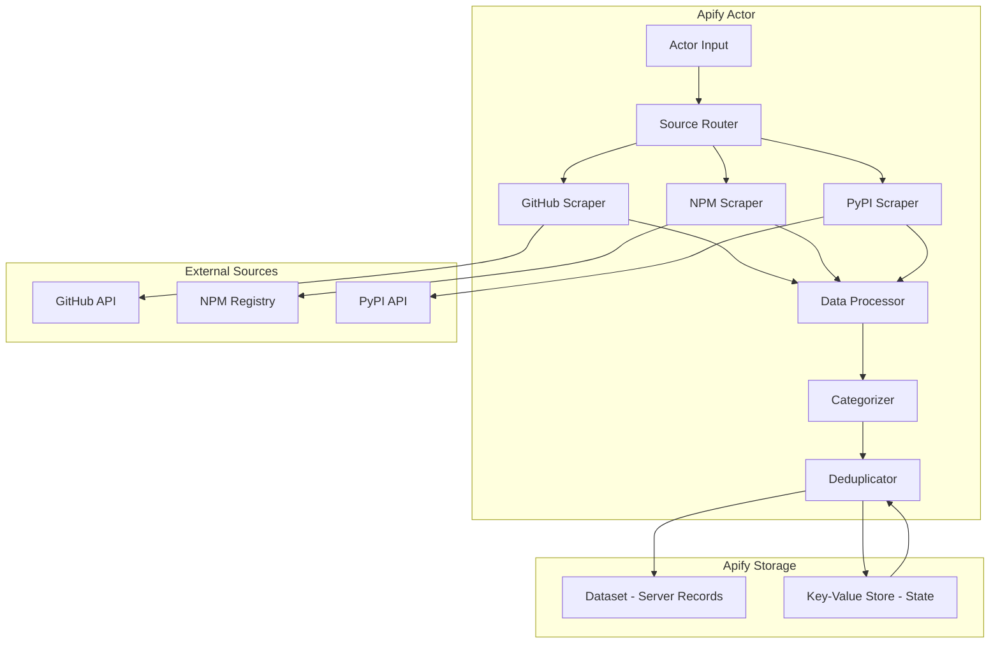

# Design Document: MCP Server Registry & Discovery Tool

## Overview

The MCP Server Registry & Discovery Tool is an Apify actor that aggregates, categorizes, and presents Model Context Protocol (MCP) servers from multiple package sources. The actor scrapes GitHub, NPM, and PyPI to discover MCP servers, extracts metadata, categorizes them, and stores the results in Apify's Dataset. The output can be consumed by frontend applications or integrated into other workflows.

**Key Design Decisions:**
- **Apify Actor Architecture**: Leverage Apify's infrastructure for scheduling, storage, and data management instead of building custom database and queue systems
- **Dataset as Storage**: Use Apify Dataset to store discovered servers, eliminating the need for PostgreSQL
- **Key-Value Store for State**: Use Apify Key-Value Store to maintain scraping state and deduplication data
- **Multi-source aggregation**: Consolidate servers found across GitHub, NPM, and PyPI into unified entries to avoid duplicates
- **Stateless categorization**: Apply keyword-based categorization during scraping without requiring a separate service
- **Metadata-only compatibility**: Infer compatibility from README and documentation analysis without executing server code

### MVP Scope

The first release delivers:
- **Multi-source discovery**: Scrape GitHub, NPM, and PyPI for MCP servers
- **Structured dataset output**: Store server records in Apify Dataset with complete metadata
- **Keyword-based categorization**: Assign servers to 8+ functional categories
- **Compatibility inference**: Detect AI client support from documentation (no runtime testing)
- **Installation instructions**: Generate commands for NPM, PyPI, and uvx
- **Deduplication**: Consolidate servers found across multiple sources
- **Configurable inputs**: Support flexible scraping via actor parameters
- **Export formats**: JSON and CSV dataset exports

**Out of scope for MVP**: Web UI, semantic search, ML categorization, runtime compatibility testing, community ratings, real-time updates

## Architecture

### System Components



### Technology Stack

**Apify Actor:**
- Node.js with TypeScript
- Apify SDK for actor development
- Crawlee for robust scraping
- Octokit for GitHub API integration
- Axios for NPM and PyPI API calls

**Data Storage:**
- Apify Dataset for server records (JSON output)
- Apify Key-Value Store for deduplication state and metadata

**Rationale:** Apify handles scheduling, scaling, monitoring, and data storage, allowing us to focus on scraping logic. Crawlee provides robust error handling and retry mechanisms out of the box.

## Components and Interfaces

### 1. Actor Input Configuration

**Responsibility:** Define actor behavior and scraping parameters.

**Input Schema:**

```typescript
interface ActorInput {
  sources: ('github' | 'npm' | 'pypi')[];  // Which sources to scrape
  updateMode?: 'full' | 'incremental';  // Full rescan or incremental update
  maxServers?: number;  // Limit results for testing
  minStars?: number;  // Minimum GitHub stars filter
  includeReadme?: boolean;  // Whether to fetch full README content
  githubToken?: string;  // Optional GitHub token for higher rate limits (secret)
  runMode?: 'test' | 'production';  // Test mode for validation
}
```

**Default Configuration:**
- Scrape all three sources
- Full update mode
- No limit on servers
- No minimum stars filter
- Include README content
- Production run mode
- Use Apify's GitHub integration if available

**Design Decision:** Provide extensive configuration options to support testing, incremental updates, and quality filtering without code changes.

### 2. Source Scrapers

**Responsibility:** Extract MCP server information from each package source.

**Key Interfaces:**

```typescript
interface ServerMetadata {
  name: string;
  normalizedName: string;  // Lowercase, hyphenated for deduplication
  description: string;
  version: string;
  sourceUrl: string;
  repositoryUrl?: string;  // GitHub repo URL if available
  packageSource: 'github' | 'npm' | 'pypi';
  author: string;
  license: string;
  stars?: number;
  downloads?: number;
  forks?: number;
  lastUpdated: Date;
  lastCommitDate?: Date;
  readme?: string;
  keywords?: string[];
  isActive: boolean;  // False if not updated in 180 days
}

interface SourceScraper {
  scrape(): Promise<ServerMetadata[]>;
}
```

**GitHub Scraper:**
- Use GitHub Search API with queries: `topic:mcp-server`, `topic:model-context-protocol`
- Search code for files matching `mcp*.json` or `*mcp-server*`
- Extract: stars, forks, last commit date, README
- Rate limit: 30 requests/minute (authenticated), 10/minute (unauthenticated)
- Concurrency: 2-3 concurrent requests to respect rate limits
- Backoff: Exponential backoff on 429 responses (start 60s, max 300s)

**NPM Scraper:**
- Use NPM Registry API search endpoint
- Query keywords: `mcp`, `mcp-server`, `model-context-protocol`
- Extract: downloads (last week), version, description, repository link
- Parse package.json for additional metadata
- No rate limits for search API
- Concurrency: 10 concurrent requests

**PyPI Scraper:**
- Use PyPI JSON API and search
- Query classifiers and keywords for MCP-related terms
- Extract: downloads, version, description, project URLs
- Parse project metadata for repository links
- No rate limits for JSON API
- Concurrency: 10 concurrent requests

**Rate Limit Handling:**
- When rate-limited, pause scraping for that source and continue with others
- Resume rate-limited source after backoff period
- Log rate limit events to run metadata
- Actor continues even if one source is completely rate-limited

**Design Decision:** Each scraper is independent and can run in parallel. GitHub uses lower concurrency and explicit backoff to avoid rate limit exhaustion. Use Crawlee's request queue for robust handling of API pagination and rate limits.

### 3. Data Processor

**Responsibility:** Normalize and enrich scraped data before categorization.

**Key Functions:**

```typescript
interface DataProcessor {
  normalizeServerName(name: string): string;
  calculatePopularityScore(server: ServerMetadata): number;
  determineActiveStatus(lastUpdated: Date): boolean;
  extractRepositoryUrl(server: ServerMetadata): string | undefined;
}
```

**Processing Steps:**
1. Normalize server names (lowercase, remove special characters, replace spaces with hyphens)
2. Calculate popularity score using formula: `(stars * 0.4) + (log10(downloads + 1) * 0.3) + (recency_factor * 0.3)`
   - `recency_factor = max(0, 1 - (days_since_update / 365))` (linear decay over 1 year)
3. Determine active status (inactive if not updated in 180 days)
4. Extract and normalize repository URLs for deduplication (lowercase, remove .git suffix, normalize GitHub URLs)

**Data Validation:**
- Validate all scraped data against TypeScript interfaces before processing
- Reject records missing required fields (name, description, version, sourceUrl)
- Normalize and sanitize text fields (remove control characters, limit length)
- Validate URLs using URL parser (reject malformed URLs)
- Log validation failures to run metadata with server name and reason
- Skip invalid records and continue processing valid ones

**Design Decision:** Strict validation ensures dataset consistency and prevents downstream errors. Invalid data is logged but doesn't halt the actor run.

### 4. Categorizer

**Responsibility:** Assign functional categories to MCP servers based on metadata.

**Key Interfaces:**

```typescript
interface Category {
  id: string;
  name: string;
  description: string;
  keywords: string[];
}

interface Categorizer {
  categorize(server: ServerMetadata): string[];
}
```

**Categorization Logic:**
- Scan server name, description, keywords, and README for category keywords
- Assign to all matching categories (multi-category support)
- Default to "Uncategorized" if no matches found

**Predefined Categories:**
- Database (postgres, mysql, mongodb, sql, database)
- API Integration (rest, graphql, api, http, webhook)
- File System (files, storage, filesystem, s3, blob)
- Development Tools (git, ci, testing, debugging, lint)
- Automation (workflow, tasks, scheduling, cron)
- Data Processing (etl, transform, analytics, pipeline)
- Security (auth, encryption, secrets, vault)
- Communication (slack, email, notifications, discord)

**Design Decision:** Use simple keyword matching for speed and predictability. Categories are stored as an array in the output record.

### 5. Compatibility Checker

**Responsibility:** Determine which AI clients support each MCP server.

**Key Interfaces:**

```typescript
interface AIClient {
  id: string;
  name: string;
}

interface CompatibilityInfo {
  client: string;
  status: 'compatible' | 'incompatible' | 'unknown';
  notes?: string;
}

interface CompatibilityChecker {
  checkCompatibility(server: ServerMetadata): CompatibilityInfo[];
}
```

**Compatibility Detection:**
1. Search README and description for mentions of AI client names
2. Check for configuration examples in documentation
3. Look for client-specific keywords (e.g., "Claude", "OpenAI", "Kiro")
4. Default to "unknown" if no information found

**Supported AI Clients:**
- Claude (Anthropic)
- OpenAI
- Kiro
- Generic MCP

**Important Constraint:** Compatibility is inferred from metadata and documentation only. The actor NEVER executes or imports MCP server code for compatibility testing. Runtime compatibility testing is a future enhancement that would require sandboxed execution environments.

**Design Decision:** Metadata-only inference is fast, safe, and sufficient for MVP. Text matching provides reasonable accuracy without security risks. Compatibility info is stored in each server record for easy filtering.

### 6. Deduplicator

**Responsibility:** Consolidate servers found across multiple sources into single records.

**Key Interfaces:**

```typescript
interface DeduplicationState {
  seenServers: Map<string, ServerMetadata>;  // Key: normalizedName
  repositoryMap: Map<string, string>;  // Key: repo URL, Value: normalizedName
}

interface Deduplicator {
  deduplicate(server: ServerMetadata): ServerMetadata | null;
  mergeServers(existing: ServerMetadata, new: ServerMetadata): ServerMetadata;
}
```

**Deduplication Strategy:**
1. Use normalized name as primary key (lowercase, strip punctuation, hyphens for spaces)
2. Use repository URL as canonical secondary key for matching (normalized: lowercase, remove .git, strip trailing slashes)
3. When duplicates found, merge data:
   - Prefer GitHub for stars, forks, last commit
   - Sum downloads from NPM and PyPI
   - Prefer longer/more detailed README
   - Keep all source URLs in sourceUrls object
   - Use most recent version number
4. Store deduplication state in Key-Value Store with key format: `dedup-state-{runId}`

**Deterministic Normalization Rules:**
- Convert to lowercase
- Remove all punctuation except hyphens
- Replace spaces and underscores with hyphens
- Collapse multiple consecutive hyphens to single hyphen
- Trim leading/trailing hyphens
- Example: "My_MCP Server!" → "my-mcp-server"

**Repository URL as Canonical Key:**
- If repository URL is available, use it as the primary deduplication key
- Normalized repository URL format: `https://github.com/owner/repo` (lowercase, no .git)
- Servers with same repository URL are always merged, even if names differ
- Servers without repository URL use normalized name only

**Design Decision:** Deduplication happens in-memory during actor run, with state persisted to KV Store for incremental updates in future runs. Repository URL is preferred over name matching to handle package name variations across sources.

## Data Models

### Dataset Output Schema

Each record in the Apify Dataset represents a unique MCP server:

```typescript
interface ServerRecord {
  // Identity
  name: string;
  normalizedName: string;
  description: string;
  
  // Versioning
  version: string;
  lastUpdated: string;  // ISO date string
  isActive: boolean;
  
  // Sources
  packageSource: string[];  // Can be found in multiple sources
  sourceUrls: {
    github?: string;
    npm?: string;
    pypi?: string;
    repository?: string;
  };
  
  // Metadata
  author: string;
  license: string;
  keywords: string[];
  
  // Metrics
  stars: number;
  downloads: number;
  forks: number;
  popularityScore: number;
  lastCommitDate?: string;  // ISO date string
  
  // Content
  readme?: string;
  
  // Classification
  categories: string[];
  compatibility: CompatibilityInfo[];
  
  // Installation
  installInstructions: {
    npm?: string;
    pypi?: string;
    uvx?: string;
    configExample?: string;
  };
  
  // Timestamps
  scrapedAt: string;  // ISO date string
}
```

### Key-Value Store Schema

**Deduplication State** (key: `dedup-state-{runId}`):
```typescript
interface DeduplicationState {
  serverMap: Record<string, {
    normalizedName: string;
    repositoryUrl?: string;
    sources: string[];
  }>;
  lastRunAt: string;  // ISO 8601 format
  updateMode: 'full' | 'incremental';
}
```

**Run Metadata** (key: `run-metadata-{runId}`):
```typescript
interface RunMetadata {
  runId: string;
  startedAt: string;  // ISO 8601 format
  completedAt: string;  // ISO 8601 format
  totalServersFound: number;
  serversBySource: {
    github: number;
    npm: number;
    pypi: number;
  };
  duplicatesRemoved: number;
  categoriesAssigned: Record<string, number>;
  runDuration: number;  // milliseconds
  errors: Array<{
    source: string;
    error: string;
    timestamp: string;  // ISO 8601 format
  }>;
  rateLimitEvents: Array<{
    source: string;
    timestamp: string;  // ISO 8601 format
    retryAfter: number;  // seconds
  }>;
  validationFailures: number;
}
```

**Dataset Versioning:**
- Each actor run writes to the default dataset
- Historical snapshots can be preserved by cloning datasets with naming: `mcp-registry-{YYYY-MM-DD}`
- Dataset retention: 30 days by default (configurable in Apify settings)
- For incremental updates, new records are appended; existing records are not modified

**Design Decision:** Use run-specific keys in KV Store to support concurrent runs and historical analysis. ISO 8601 timestamps ensure consistent date handling across timezones.

## Non-Functional Requirements

### Performance (NFR-1, NFR-2, NFR-3, NFR-4)

- **Run Duration**: Complete full discovery scan within 60 minutes (3600 seconds)
- **Search Latency**: Return search results within 2 seconds (frontend requirement)
- **Memory Limit**: Operate within 4096 MB memory allocation
- **Batch Processing**: Process servers in batches of 100 to optimize memory usage
- **Rate Limit Handling**: Exponential backoff with 3 retries for API failures

### Reliability (NFR-5, NFR-6, NFR-7, NFR-8)

- **Retry Policy**: Retry failed API calls up to 3 times with exponential backoff (60s, 120s, 300s)
- **Graceful Degradation**: Continue processing other sources when one source is rate-limited
- **State Persistence**: Maintain deduplication state across runs to prevent duplicates
- **Error Isolation**: Log and skip invalid servers without halting the entire run

### Usability (NFR-9, NFR-10, NFR-11, NFR-12)

- **Zero Configuration**: Execute successfully with default input parameters
- **Progress Logging**: Provide clear progress updates during execution (INFO level)
- **Error Messages**: Generate human-readable error messages for common failures
- **Export Formats**: Support JSON and CSV dataset exports

### Security (NFR-13, NFR-14, NFR-15, NFR-16)

- **No Code Execution**: Never execute or import MCP server code
- **Public Data Only**: Only scrape publicly available metadata
- **Data Sanitization**: Sanitize all scraped data before storage
- **Secure Secrets**: Store API tokens using Apify secret input fields

## Error Handling

### Scraping Errors

**API Rate Limiting:**
- Use Crawlee's built-in rate limiting and retry logic
- Implement exponential backoff for GitHub API
- Log rate limit errors to run metadata
- Continue with other sources if one is rate-limited

**Network Failures:**
- Retry failed requests up to 3 times (Crawlee default)
- Log network errors with source and URL
- Skip failed servers and continue processing
- Report failed servers in run metadata

**Invalid Data:**
- Validate scraped data against TypeScript interfaces
- Log validation errors with server name and source
- Skip invalid servers
- Continue processing valid servers

### Data Processing Errors

**Categorization Failures:**
- Default to "Uncategorized" category
- Log servers that couldn't be categorized
- Continue processing

**Deduplication Errors:**
- If state loading fails, start fresh
- Log deduplication conflicts
- Prefer most recent data when conflicts occur

**Dataset Write Errors:**
- Retry dataset writes up to 3 times
- Log failed writes
- Continue with next server

## Testing Strategy

### Unit Tests

**Source Scrapers:**
- Test metadata extraction from API responses
- Test pagination handling
- Test error handling for invalid responses
- Mock external API calls

**Data Processor:**
- Test name normalization logic
- Test popularity score calculation
- Test active status determination
- Test repository URL extraction

**Categorizer:**
- Test keyword matching for each category
- Test multi-category assignment
- Test uncategorized fallback

**Compatibility Checker:**
- Test client detection in README
- Test unknown status default
- Test multiple client detection

**Deduplicator:**
- Test duplicate detection by name
- Test duplicate detection by repository URL
- Test server merging logic
- Test state persistence

### Integration Tests

**End-to-End Actor Run:**
- Test complete actor execution with all sources
- Verify dataset output format
- Verify deduplication across sources
- Test with limited maxServers for speed

**Source Integration:**
- Test GitHub API integration with real API
- Test NPM Registry API integration
- Test PyPI API integration
- Verify rate limiting behavior

### Manual Testing

**Data Quality:**
- Manually review sample of scraped servers
- Verify categorization accuracy
- Check installation instructions
- Verify compatibility detection

**Actor Configuration:**
- Test with different input configurations
- Test with single source
- Test with maxServers limit
- Test with and without README fetching

**Sample Test Fixtures:**

Use these known MCP servers for testing and validation:

1. **@modelcontextprotocol/server-filesystem** (NPM)
   - Category: File System
   - Expected: NPM source, installation instructions, README

2. **mcp-server-postgres** (GitHub)
   - Category: Database
   - Expected: GitHub stars/forks, PostgreSQL keywords

3. **anthropic/mcp-server-slack** (GitHub)
   - Category: Communication
   - Expected: High stars, Claude compatibility

4. **mcp-server-fetch** (Multi-source)
   - Category: API Integration
   - Expected: Found in both NPM and GitHub, deduplication test

5. **edge-case-server** (Minimal metadata)
   - Category: Uncategorized
   - Expected: Handles missing README, minimal keywords

**Design Decision:** Known test fixtures enable reproducible testing and demonstrate working E2E functionality to evaluators.

## Deployment and Usage

### Apify Platform

**Actor Configuration:**
- Set up scheduled runs (daily at 2 AM UTC)
- Configure memory: 4096 MB (NFR-2)
- Configure timeout: 3600 seconds (1 hour, NFR-1)
- Enable dataset retention for 30 days

**Environment Variables:**
- `GITHUB_TOKEN`: Optional GitHub personal access token for higher rate limits (stored as secret)
- `LOG_LEVEL`: Set to `INFO` for production, `DEBUG` for development

**Monitoring and Alerting:**
- Alert on actor run failures (email/webhook)
- Alert when error rate exceeds 10% of total servers
- Alert when run duration exceeds 3300 seconds (55 minutes, 90% of timeout)
- Alert when validation failure rate exceeds 5%
- Monitor GitHub rate limit consumption (alert at 80% usage)
- Track dataset size growth trends (alert on unexpected spikes)
- Monitor run duration trends (alert on 50% increase over 7-day average)

**Alert Destinations:**
- Apify platform notifications (email)
- Optional webhook for external monitoring systems
- Run metadata includes all error details for post-run analysis

**Design Decision:** Proactive monitoring prevents silent failures and enables rapid response to API changes or rate limit issues.

### Data Consumption

**Direct Dataset Access:**
- Use Apify API to fetch dataset items
- Filter and search using Apify's dataset query language
- Export to JSON, CSV, or other formats

**Integration with Frontend:**
- Fetch dataset via Apify API on page load
- Implement client-side search and filtering
- Cache dataset in browser for performance
- Refresh data daily or on-demand

**API Wrapper (Optional Future Enhancement):**
- Build lightweight API service that wraps Apify dataset
- Add search indexing (Algolia, Elasticsearch)
- Implement caching layer (Redis)
- Provide REST endpoints for frontend

**Design Decision:** Start with direct dataset consumption. Add API wrapper only if search performance or query complexity requires it.

## Performance Considerations

**Scraping Performance:**
- Run source scrapers in parallel
- GitHub concurrency: 2-3 requests (rate limit bottleneck)
- NPM/PyPI concurrency: 10 requests each
- Implement request caching for repeated URLs
- Target completion within 60 minutes for full run (NFR-1)

**Data Processing:**
- Process servers in batches of 100
- Write to dataset in batches of 50 to reduce API calls
- Keep deduplication state in memory during run
- Memory limit: 4096 MB (NFR-2)

**Dataset Size:**
- Estimate 500-2000 servers initially
- Each record ~5-50 KB (depending on README size)
- Total dataset size: 2.5-100 MB
- Well within Apify's limits

**Rate Limits:**
- GitHub: 30 req/min (authenticated) - bottleneck
- NPM: No limits
- PyPI: No limits
- Strategy: Process GitHub with lower concurrency and exponential backoff

**Performance Tuning Knobs:**
- `batchSize`: Number of servers to process before writing to dataset (default: 50)
- `githubConcurrency`: Concurrent GitHub requests (default: 2, max: 5)
- `npmConcurrency`: Concurrent NPM requests (default: 10)
- `pypiConcurrency`: Concurrent PyPI requests (default: 10)
- `includeReadme`: Fetch README content (default: true, disable for faster runs)

**Design Decision:** Configurable performance knobs allow rapid tuning without code changes. Conservative defaults prevent rate limit issues.

## Future Enhancements

**Phase 2 Features:**
- Community ratings and reviews
- User-submitted compatibility reports
- Automated compatibility testing
- Trending servers (velocity metrics)
- Server health monitoring

**Phase 3 Features:**
- ML-based categorization
- Semantic search
- Recommendation engine
- Integration with package managers
- Browser extension for quick server lookup

## Security and Legal Considerations

**Security Constraints:**
- NEVER execute or import MCP server code (NFR-13)
- Only scrape publicly available metadata (NFR-14)
- Sanitize all scraped data before storage (NFR-15)
- Store API tokens securely using Apify secret input fields (NFR-16)
- Validate and sanitize URLs to prevent injection attacks
- Limit README size to 500 KB to prevent memory exhaustion
- Remove control characters and potentially malicious content from text fields

**Privacy and Terms of Service:**
- Only scrape publicly available repository and package metadata
- Respect robots.txt and API rate limits
- Do not scrape private repositories or packages
- Users should verify compliance with GitHub, NPM, and PyPI Terms of Service
- No personal data is collected or stored
- All data is sourced from public package registries

**Supply Chain Trust Signals (Future Enhancement):**
- Author verification status (GitHub verified badge)
- Package signing and verification
- Dependency vulnerability scanning
- Publish frequency anomaly detection
- Repository activity patterns

**Design Decision:** Security-first approach prevents code execution risks. Legal compliance ensures sustainable operation.
